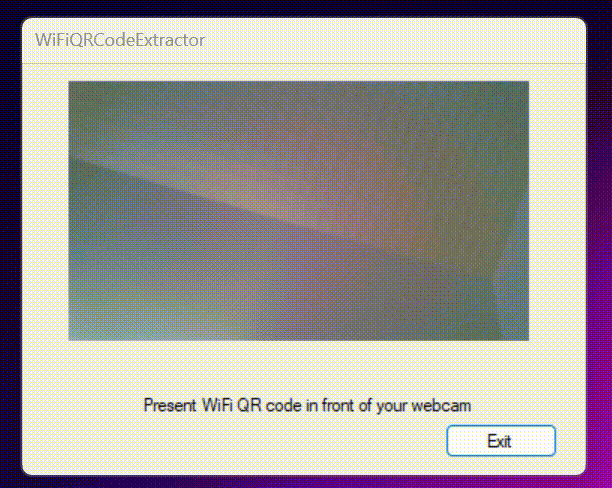

# WiFiQRCodeExtractor

A simple WiFi QRCodes reader for Windows.

Just show the QRCode in front of your integrated webcam and this program will extract password from it and put it into your clipboard.

